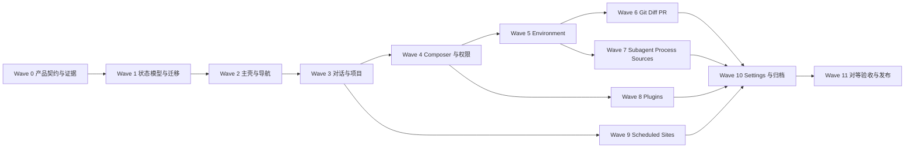

# AIChat Codex Desktop 操作对等开发计划

> 状态：当前产品与开发计划的单一权威入口  
> 制定日期：2026-08-01  
> 目标平台：Avalonia Desktop（macOS、Windows、Linux）

## 1. 权威性与范围变更

用户已经明确决定：AIChat 在完成 Codex Desktop 的核心功能与用户操作对等之前，不追求产品创新。

当本文与以下旧文档发生冲突时，以本文为准：

- `PRODUCT_BASELINE.md`
- `PRODUCT_SCOPE.md`
- `ROADMAP_1.0.md`
- `REMAINING_DEVELOPMENT_PLAN.md`
- `REFACTOR_PLAN.md`

旧文档中仍然有效的工程约束继续保留：Avalonia 是唯一产品界面；Provider、Agent、权限、Git、持久化与 UI 保持分层；文件写入、Shell、Git 和外部工具不得绕过审批、路径保护与审计；所有改动必须通过构建和测试。

本文废止以下旧范围判断：

- “每个对话必须属于一个项目”。AIChat 必须同时支持普通聊天与项目编码会话。
- “插件、后台运行、多 Agent 不进入默认产品面”。这些能力必须以 Codex Desktop 对应的信息架构进入产品，但默认权限仍保持保守。
- “Context economics、缓存命中率和低 Token 成本主导 UI”。这些能力保留为内部诊断或次级信息，不得压过用户的编码工作流。
- “先做大规模内部重构，再做产品界面”。只有阻塞操作对等的重构才进入当前路线。

## 2. 产品目标

AIChat 的目标不是复制 Codex 品牌，而是复刻其成熟的用户操作模型：

- 同等清晰的全局导航、项目与会话层级。
- 同等低摩擦的新对话、添加项目、恢复历史与切换环境流程。
- 同等集中的 Composer、权限、模型和上下文操作。
- 同等可见的 Git、Diff、子智能体、后台进程与来源状态。
- 同等完整的插件、已安排任务、PR 和设置旅程。
- 同等稳定的键盘语义、焦点、反馈、停止、重试与恢复。

保留 AIChat 的差异仅限必要的产品身份与技术兼容：

- 使用 AIChat 名称、图标、文案和设计资产。
- 保留 DeepSeek、MiMo、MiniMAX、OpenAI-compatible 与 Anthropic-compatible Provider。
- 保留跨平台 Avalonia 实现。
- 不复制 Codex 的商标、Logo、专有图标或不可获得的私有云基础设施。

在操作对等完成前，不新增无法映射到 Codex Desktop 现有用户旅程的一级功能。

## 3. 对等的定义

一项功能只有同时满足以下条件才算完成：

1. **入口对等**：用户能在预期位置找到功能。
2. **步骤对等**：完成任务所需的点击、按键和决策数量相近。
3. **状态对等**：运行、等待审批、失败、停止、完成和恢复均可见。
4. **恢复对等**：失败、拒绝、关闭窗口或重启应用后能继续工作。
5. **功能真实**：导航和按钮必须连接真实能力，不允许用占位页面冒充完成。
6. **安全对等**：文件、Shell、Git、插件和外部连接必须经过作用域明确的权限链路。
7. **可验证**：必须有自动测试以及 Computer Use 的可见结果。

“XAML 看起来相似”不等于操作对等。

所有功能必须登记在版本化的对等追踪表中：

| Feature ID | 功能 | 证据等级 | 目标用户旅程 | 实现状态 | 自动测试 | Computer Use 证据 | 延后原因 |
|---|---|---|---|---|---|---|---|
| 示例 | 新建普通聊天 | 截图 + 官方确认 | `UJ-CHAT-01` | planned | pending | pending | — |

证据等级固定为：

- `screenshot-confirmed`：用户提供的截图直接可见。
- `official-confirmed`：当前官方文档明确说明。
- `observed`：Computer Use 实际操作确认。
- `inferred`：仅从名称或布局推断，不得作为完成依据。
- `deferred`：已有证据但明确不进入当前 Wave，并记录原因。

没有 Feature ID、验收旅程和可见证据的功能不得宣称达到 parity。

## 4. 目标信息架构

```text
AIChat Desktop
├── 全局入口
│   ├── 新对话
│   ├── 拉取请求
│   ├── 站点
│   ├── 已安排
│   └── 插件
├── 项目
│   ├── 一个或多个文件夹
│   ├── Primary 工作目录
│   ├── 项目设置与权限
│   └── 多个项目编码会话
├── 普通聊天
│   └── 不绑定项目、不默认读取或修改本地代码
├── 当前会话
│   ├── Transcript
│   ├── Composer
│   ├── 会话级模型与权限
│   └── Environment
│       ├── Git / Diff / Branch / Worktree
│       ├── Subagents
│       ├── Background Processes
│       └── Sources
└── 设置中心
    ├── 个人
    ├── 集成
    ├── 编码
    └── 已归档聊天
```

官方行为基线：

- [Projects and chats](https://learn.chatgpt.com/docs/projects)
- [Plugins](https://learn.chatgpt.com/docs/plugins)
- [Scheduled tasks](https://learn.chatgpt.com/docs/automations)
- [Subagents](https://learn.chatgpt.com/docs/agent-configuration/subagents)
- [Sandboxing and permissions](https://learn.chatgpt.com/docs/sandboxing)
- [Sites](https://learn.chatgpt.com/docs/sites)

## 5. 当前能力的处理原则

### 5.1 保留并接入新界面

- Agent Harness、模型/工具循环、流式事件、停止、重试和继续。
- OpenAI-compatible 与 Anthropic-compatible Provider。
- Tool approval、工具风险元数据、项目路径保护和敏感数据清理。
- Git status、diff、stage、unstage、restore、commit 的底层服务。
- 图片附件、`@file` 上下文和 InputArtifact。
- SubAgent 调度、运行记录与验证结果。
- 项目文件索引、上下文估算和自动验证。
- JSON 持久化、凭据保护和隔离运行配置。

### 5.2 必须重做

- `ProjectWorkspace → Conversation` 的强绑定语义。
- Sidebar、ConversationList 与 MainWindow 的导航协调。
- 新对话和添加项目流程。
- 运行记录作为一级导航的设计；历史应回归会话。
- Settings modal；改为全页设置中心和可搜索分类。
- 会话级模型、权限、环境和来源控制。
- Git modal；改为 Environment 与 Diff 工作区。
- Subagent 只显示状态行的界面；增加独立 inspector。

### 5.3 必须新增

- Standalone Chat。
- Session 与 Environment 状态模型。
- Sources 状态与引用模型。
- Background Process supervisor。
- Plugin 生命周期、能力授予、安装与更新模型。
- Scheduled Task 状态与执行历史。
- PR 聚合页面和创建流程。
- 多文件夹项目、Primary 目录与 Worktree。

### 5.4 明确不做

- 不重新加入 IDE 式文件树。
- 不复制 Codex 名称、Logo 和专有资产。
- 不创建没有后端能力的一级导航占位。
- 不为“代码更漂亮”进行与对等目标无关的大重构。
- 不在功能对等完成前新增 Benchmark、A2A 或自创 Agent Dashboard。

## 6. 开发策略

采用纵向切片，而不是一次性重写全部 UI。

每个 Wave 必须满足：

- 应用始终可构建、可运行、可回退。
- 新旧数据可迁移，用户项目与对话不得丢失。
- 至少完成一条真实用户旅程。
- 不提前展示下一 Wave 的无功能入口。
- 合并前完成自动测试和对应的 Computer Use 验收。

依赖顺序：



## 7. 分阶段计划

### Wave 0：产品契约、竞品证据与文档统一

目标：在写 UI 之前冻结“复刻什么”。

工作项：

- 将本文设为唯一当前计划入口。
- 同步 `PRODUCT_SCOPE.md`、`PRODUCT_BASELINE.md`、`ROADMAP_1.0.md` 和 `REMAINING_DEVELOPMENT_PLAN.md`。
- 将 `REFACTOR_PLAN.md` 标记为历史计划，只保留仍然有效的工程债证据。
- 使用干净配置和 Computer Use 采集以下 Codex Desktop 页面：
  - 新对话菜单与普通聊天。
  - 添加/编辑项目、多文件夹与 Primary 目录。
  - 项目和会话更多菜单。
  - PR、Plugins、Scheduled、Sites。
  - Diff、审批、失败、停止与恢复。
  - Environment 各区展开状态。
  - 所有设置二级页面。
- 为每条旅程记录起点、点击、按键、焦点、反馈、失败和恢复。
- 建立版本化的 Feature → Journey → Evidence → Test 对等追踪表，并在每个 Wave 更新。
- 建立视觉 token、快捷键和文案映射表。
- 确认账户、登录、更新、帮助、隐私、导入、宠物等设置入口的真实行为；不能确认的项目标记 `inferred` 或 `deferred`。

交付物：

- 竞品操作证据目录。
- 功能与页面清单。
- 状态机与导航图。
- 视觉 token 表。
- 用户旅程验收矩阵。
- 对等追踪表。

退出条件：

- 所有一级入口都有真实功能定义。
- 所有推断项被标记为“已确认”或明确延后。
- 每个后续 Wave 都有可追溯的 Feature ID、自动测试和 Computer Use 场景。
- 旧文档不再出现互相冲突的权威声明。

### Wave 1：Session、Environment 与持久化迁移

目标：先建立支持普通聊天和项目编码会话的真实状态模型。

领域模型：

- `ChatSession`
  - `Standalone`
  - `Project`
- `WorkspaceProject`
  - 多个 folder roots
  - primary root
  - project instructions
- `ExecutionEnvironment`
  - local / remote / worktree
  - working directory
  - branch
- `SourceReference`
- `BackgroundProcessRecord`
- `PluginInstallation` 与 `PluginCapabilityGrant`
- `PermissionGrant`
  - global / project / session / plugin / tool

实现要求：

- 旧 `ProjectWorkspace` 与 `Conversation` 数据自动迁移为 Project Session。
- Provider 密钥迁移不得触碰或泄露明文。
- 所有迁移先备份，再原子写入。
- 迁移必须幂等；失败时继续读取旧数据或恢复备份。
- 去掉使用“未选择项目”等显示字符串代表语义状态的做法。
- 为高频进程状态使用独立 store，避免频繁重写整个 `projects.json`。
- 新增 `MigrationCoordinator`、schema version、backup manifest 和只读恢复模式；`PersistenceRevision` 只负责并发控制，不能代替 schema version。
- 使用 expand-migrate-contract：先发布兼容的新 reader 与 feature flag，再迁移并切换 writer，稳定后才移除旧 reader。
- 损坏文件 quarantine 只是隔离措施，不得被视为数据恢复；必须提供备份选择、恢复结果和错误说明。
- 持久化门槛采用平台可证明的 durable flush + 原子替换；实现和测试必须证明落盘语义，不能只依赖 `FlushAsync` 的名称。

主要模块：

- `AIChat.Domain`
- `AIChat.Abstractions/Persistence`
- `AIChat.Storage.Json`
- `ServiceRegistration`

退出条件：

- 可创建、保存、重启恢复 Standalone 与 Project Session。
- 旧项目、对话、运行历史、附件和权限不丢失。
- 损坏、缺字段、未知字段与中断写入均有测试。
- MigrationCoordinator、backup manifest、只读恢复和 feature flag fallback 有集成测试。
- AppHost 可以解析所有新增服务。

### Wave 2：三栏主壳与全局导航

目标：建立 Codex Desktop 同类的信息架构，但暂不展示没有功能的入口。

布局：

- 左侧：全局导航、项目/会话层级、最近、账户。
- 中央：会话标题、Transcript、固定 Composer。
- 右侧：可显示/隐藏的 Environment 面板。
- Settings 改为独立全页 Route，而不是覆盖式 modal。

视觉基线：

- 左侧栏约占窗口宽度 20%。
- 顶部栏约 90 px。
- Composer 固定底部并限制最大宽度。
- Environment 面板窄窗口时可折叠，不挤压 Composer。
- 所有颜色、间距、圆角和阴影来自 token。
- Dark 与 Light 在运行时完整切换。

架构要求：

- 新建 `AppShellViewModel`、`NavigationViewModel`、`SessionHostViewModel`、`EnvironmentPanelViewModel`。
- 不继续向 `MainWindowViewModel` 聚合所有业务状态。
- 每个 UserControl 在 use-site 显式设置正确的 DataContext。
- 路由状态可持久化，但不将临时 modal 状态写进领域模型。

退出条件：

- 应用启动后 Composer 自动获得焦点。
- Sidebar 可折叠、项目可展开，会话切换不闪烁。
- 宽屏、窄屏、Light、Dark 均无重叠和不可见控制。
- 尚未实现的 PR、Sites、Scheduled、Plugins 入口保持隐藏。

### Wave 3：新对话、项目与历史

目标：完成用户最常用的四条旅程。

#### 3.1 普通聊天

- `⌘N` 或“新对话”创建 Standalone Session。
- 不默认读取项目文件、不显示 Git 操作。
- 可以后续移动或复制到项目会话，但必须明确告知上下文变化。
- 移动或复制前显示目标项目、将获得的文件/工具权限和 Git 能力；取消、失败和重复执行保持幂等并可回滚。

#### 3.2 添加项目

- 从“新对话”菜单、项目区 `+` 或 `⌘O` 进入同一个流程。
- 选择文件夹后自动读取名称、Git 状态、AGENTS、配置与验证命令。
- 支持添加多个目录和设置 Primary。
- 不显示文件树。
- 目录不可访问、用户拒绝权限、非 Git 目录、AGENTS/config 解析失败、多目录 Primary 冲突和分支不存在时，显示独立错误与重试路径；项目仍可在安全能力范围内使用。

#### 3.3 项目编码会话

- 从项目下创建会话，自动继承 Primary、分支、权限和项目说明。
- 一个会话对应一个明确 outcome，而不是清空旧 feed 复用同一对象。
- 切换项目不会串用草稿、运行状态和上下文。

#### 3.4 历史管理

- 搜索、重命名、置顶、归档、恢复。
- 最近会话跨项目聚合。
- 运行历史并入原会话，不再占据主导航。

退出条件：

- 普通聊天：1 个快捷键创建，200 ms 内 Composer 聚焦。
- 添加项目：选择目录后 2 s 内侧栏、当前项目与健康状态一致。
- 项目会话：最多 2 次点击开始新任务。
- 搜索结果 500 ms 内出现；归档和恢复不超过 2 次点击。
- 重启后保持项目、会话、折叠、置顶和归档状态。
- 普通聊天移动/复制到项目后，权限、Sources、Environment 和 Git 状态按确认内容变化；失败时原会话完整保留。
- 添加项目的拒绝、非 Git、配置损坏和 Primary 冲突场景通过 Computer Use 验收。

### Wave 4：Composer、模型、权限与上下文

目标：让高频控制集中在输入区，消除重复状态。

Composer 必须包含：

- 多行输入与可靠焦点。
- `+` 菜单：文件、图片、来源、插件与可用上下文。
- 附件 chip、删除、失败状态和大小限制。
- 会话级模型与推理等级。
- 会话级权限 profile。
- `@` 补全和 Slash 命令菜单。
- 语音输入入口；没有真实转写能力前不得显示。
- 发送、停止、追加要求、重试。

权限模型：

- Read only / Workspace / Full access。
- Ask for approval / Session allow / Deny。
- Global、Project、Session、Plugin、Tool 作用域清晰可见。
- Full access 必须展示风险，但不反复阻断已确认的会话。
- 每次权限决定进入审计记录。

退出条件：

- 模型、权限和上下文只在 Composer 附近显示一次。
- 切权限不超过 2 次点击，200 ms 内反馈。
- 粘贴图片 500 ms 内出现附件，发送后升级为 InputArtifact。
- 运行中 `Esc` / `⌘.` 在 1 s 内停止并保留已完成工作。
- 错误、停止和拒绝均不丢草稿。

### Wave 5：Environment 面板

目标：把当前会话正在操作的环境集中到右侧。

区块：

- 变更统计与 Diff 入口。
- Local / Remote / Worktree 环境。
- 当前目录与分支。
- Commit / Push / Create PR。
- Subagents。
- Background Processes。
- Sources。

实现要求：

- 面板数据只来自当前 Session 的 Environment。
- Standalone Session 隐藏项目和 Git 区块，而不是显示错误。
- 每个区块支持摘要、展开、加载、失败和空状态。
- 面板可折叠，状态变化不抢走 Composer 焦点。

退出条件：

- 切会话后 1 s 内环境信息完全更新，无前一会话残留。
- Git、Subagent、进程和来源状态可独立刷新。
- 面板折叠状态持久化。
- 右侧异常不阻塞发送普通聊天。

### Wave 6：Git、Diff、Worktree 与 PR

目标：把现有 Git 能力转成完整的审查与交付流程。

工作项：

- Environment 中显示 staged / unstaged / untracked 和增删统计。
- Diff 工作区支持文件列表、行级查看、复制、反馈和恢复。
- Stage、Unstage、Restore、Commit、Push。
- Branch 选择、创建与切换。
- Worktree 创建、复用、清理和 Session 绑定。
- PR 列表、详情、创建、状态和链接复制。
- GitHub 不可用时显示明确依赖，不伪造成功。

退出条件：

- 所有 Git mutation 经过审批与路径保护。
- 拒绝审批后 Git 状态不变。
- 冲突、认证失败和 push 失败保留用户输入并给出恢复路径。
- 临时仓库集成测试覆盖 diff、restore、commit、branch 和 worktree。
- Computer Use 完成“查看变更 → 提交 → 创建 PR”旅程。

### Wave 7：Subagents、后台进程与来源

目标：让长任务可观察、可中断、可恢复。

#### Subagents

- Active / Done / Failed 分组。
- 查看独立线程、任务、模板、时长与结果。
- 停止、转向、重试和关闭单个 Subagent。
- 主会话只接收摘要，不塞入全部日志。

#### Background Processes

- 统一监督测试、构建、开发服务器和插件命令。
- PID、命令、开始时间、状态、退出码和日志尾部。
- 停止时杀死整个子进程树。
- 应用退出时安全清理，或明确标识可重连进程。
- 状态使用独立持久化，不频繁重写项目文件。
- Wave 7 的第一个基础 PR 必须先实现 `BackgroundProcessSupervisor`、registry、跨平台进程树终止策略、启动扫描和孤儿进程策略；在此之前不得展示后台进程入口。

#### Sources

- 文件、图片、网页搜索、连接器与插件来源统一建模。
- 来源可添加、查看全部、移除和重新授权。
- 消息和结果能回溯到对应来源。
- 无法读取时显示真实错误，不静默忽略。

退出条件：

- 子智能体和进程状态 1 s 内更新。
- 停止后台进程不超过 2 次点击，1 s 内进入停止状态。
- 不产生孤儿进程。
- macOS、Windows、Linux 分别验证子进程树终止、应用退出清理和重启后的中断/重连策略。
- 来源失败可重试，并保留 Composer 草稿。
- 重启后已完成记录可读，运行中记录被正确恢复或标为中断。

### Wave 8：插件目录与能力生命周期

目标：将“能加载 `plugin.json`”升级为用户真正能使用的插件系统。

现状边界：当前运行时只支持 manifest 中的 command-style tools。Skills、MCP、Connectors、Hooks、UI resources、安装信任链和能力授权都属于本 Wave 要新建的基础设施，不得视为已有能力的简单 UI 包装。

插件旅程：

```text
发现 → 搜索 → 详情 → 安装 → 审查权限 → 连接账户 → 启用
→ 在 Composer 中通过 @ 使用 → 查看调用 → 更新 / 禁用 / 卸载
```

能力模型：

- Skills。
- Command tools。
- Connectors。
- MCP servers。
- Hooks。
- 可选 UI resources。
- Scheduled task templates。

能力实现顺序：

1. 现有 Command plugin 的安装、来源校验、授权、进程监督和卸载。
2. Skills loader 与版本兼容。
3. MCP transport、tool discovery、auth 与 capability grants。
4. Connector OAuth、取消、重授权和凭据清理。
5. Hooks、UI resources 与 scheduled templates。

安全要求：

- 安装和升级必须展示来源、版本、权限与外部进程。
- 未授权能力默认拒绝。
- Plugin、Project 与 Session grants 分离。
- Hook 与外部命令不得绕过 Tool approval。
- 日志和错误必须经过敏感信息清理。
- 安装未知本地代码需要用户确认。
- 安装包记录来源、签名或内容哈希、兼容版本和依赖；安装目录防篡改并在执行前复核，降低 TOCTOU 风险。
- 外部进程使用环境变量白名单，不继承无关凭据。
- Connector OAuth 的取消、失败、过期、重授权和卸载必须清理授权状态与本地凭据。

退出条件：

- 插件入口只在目录、安装、授权、启用和卸载均可工作后显示。
- 至少完成一个 Skills-only 插件和一个 MCP/Command 插件的端到端验收。
- Connector 与 Hook 分别完成授权、拒绝、撤销和恶意输入安全验收。
- 安装失败不留下半安装状态。
- 升级可回滚，卸载不会破坏历史会话。
- 不兼容版本、依赖冲突、断网升级、安装目录篡改和 OAuth 失败均有恢复矩阵。
- Computer Use 完成完整插件旅程。

### Wave 9：已安排任务与 Sites

目标：补齐截图中的剩余全局入口。

#### Scheduled

- 选择项目、Prompt、Cadence 与 Execution Environment。
- Local 与 Dedicated Worktree。
- 启用、暂停、立即运行、查看历史、重试和归档。
- 需要审批但无人交互时明确失败，不自动升级权限。
- 支持编辑、删除、并发策略、应用重启恢复、网络断开和凭据失效后的重试。

#### Sites

- 项目列表、创建、预览、保存、部署和环境变量管理。
- 本地预览必须真实运行。
- 云部署通过 adapter 接入可用 Hosting Provider。
- 没有可用 Hosting Provider 时隐藏部署动作并解释依赖。
- 支持项目编辑、删除、部署历史、应用重启恢复、网络断开和凭据失效后的恢复。

退出条件：

- 创建 Schedule 不超过 4 个主要步骤。
- 保存后 1 s 内进入列表，暂停/恢复不超过 1 次点击。
- Scheduled run 使用独立审计和工作目录。
- Scheduled 的编辑、删除、并发运行、重启恢复和凭据失效场景通过测试。
- Sites 本地预览、停止和重启没有孤儿进程。
- Sites 项目、环境变量和部署记录重启后保持；部署失败不丢配置并可重试。
- 不伪造云部署成功。

### Wave 10：设置中心、搜索与归档

目标：完整复刻截图中的设置结构，并把全局配置从工作区移走。

一级分类：

- 个人：常规、导入、个人资料、外观、语音、配置、个性化、宠物、键盘快捷键、使用情况和计费、账户。
- 集成：智能快照、插件、浏览器、电脑操控。
- 编码：钩子、连接、Git、环境、工作树。
- 已归档：已归档的聊天。

规则：

- Wave 0 未确认具体功能的分类不得凭名称猜字段。
- 不适用于 AIChat 的云账户字段要么通过 adapter 实现，要么明确省略并记录原因。
- `⌘,` 打开设置；Esc 或“返回应用”返回原会话和焦点。
- 搜索结果 500 ms 内出现并直接定位设置。
- 所有设置说明作用域、风险、默认值和是否需要重启。
- 高风险恢复默认、删除账户数据等操作必须确认。

退出条件：

- 所有已实现设置可搜索。
- 修改立即反馈，重启后保持。
- 权限、语言、外观、默认编辑器、Git、Environment、Worktree、Plugin 等形成完整流程。
- 键盘和屏幕阅读器可以操作所有控件。

### Wave 11：对等验收、迁移 Beta 与发布

目标：证明 AIChat 的主要操作旅程达到可日用水平。

工作项：

- 使用干净配置执行完整 Computer Use 验收矩阵。
- 使用真实 Provider 完成普通聊天和项目编码任务。
- 使用真实 Git 仓库完成 diff、审批、验证、commit 和 PR。
- 运行插件、MCP、Scheduled、Subagent 和后台进程安全场景。
- 在 macOS、Windows、Linux 运行打包与真机 smoke。
- 测试旧版本数据升级、升级中断、恢复备份和重复迁移。
- 检查键盘、焦点、可访问性、Light/Dark 和窗口缩放。
- 更新安装、帮助、快捷键、隐私、权限与发布说明。

退出条件见第 10 节。

#### Wave 11 first-slice ship (2026-08-02)

P0 gate 全部通过:
- `dotnet build` 0 警告 0 错误
- `dotnet test` 788/788 pass (从 712 基线 +76)
- `git diff --check` 干净
- AppHost DI 35/35 + 干净隔离启动 ALIVE=yes

12 wave first-slice 全部 ship。完整 ship 报告 + deferred items 清单见 `docs/SHIP_REPORT_2026-08-02.md`。

P1 deferred items (进入 Parity Beta 前必做,见 ship 报告 §4):
- Sub-agent 停止/取消 (需要 `AgentHarness.CancelSubAgentAsync` registry)
- BackgroundProcessSupervisor (进程树 kill / log tail / 跨平台)
- Plugin install/uninstall + capability grants + trust chain
- 真实本地预览 / cron 调度 / 云部署 adapter
- Settings 全页 Route (当前是 modal) + 12 H2 章节完整实现
- Computer Use 验收矩阵 (需 user 真机跑)
- 跨平台真机 smoke (Windows / Linux)
- 真实 Provider 端到端 smoke (至少 2 个)

## 8. 用户操作预算

以下是默认验收上限，不是主观建议：

| 用户旅程 | 操作预算 | 反馈预算 |
|---|---:|---:|
| 新建普通聊天 | 1 个快捷键或 1 次点击 | 200 ms 内 Composer 聚焦 |
| 添加项目 | 2 次点击进入 folder picker | 2 s 内项目状态一致 |
| 项目内新建会话 | 最多 2 次点击 | 200 ms 内 Composer 聚焦 |
| 搜索历史 | 1 个快捷键 + 输入 | 500 ms 内结果出现 |
| 归档或恢复 | 最多 2 次点击 | 列表即时更新 |
| 切换权限 | 最多 2 次点击 | 200 ms 内状态更新 |
| 打开 Diff | 最多 2 次点击 | 1 s 内显示加载或内容 |
| 停止任务或进程 | 最多 2 次点击 | 1 s 内进入停止状态 |
| 打开设置 | 1 个快捷键 | 200 ms 内显示 |
| 搜索设置 | 1 次点击 + 输入 | 500 ms 内结果出现 |
| 打开插件目录 | 1 次点击 | 1 s 内显示加载或内容 |
| 安装并授权插件 | 每一步最多 3 次点击 | 每一步持续显示状态 |
| 新建 Scheduled Task | 最多 4 个主要步骤 | 1 s 内进入列表 |
| 添加 Source | 最多 2 次点击 | 1 s 内显示来源或错误 |
| 查看或重试 Subagent | 最多 2 次点击 | 1 s 内显示状态变化 |
| 切换 Branch / Worktree | 最多 3 次点击 | 1 s 内显示切换状态 |
| 创建 PR | 最多 4 个主要步骤 | 成功后显示可复制链接 |
| 创建 Sites 项目 | 最多 3 个主要步骤 | 1 s 内进入项目或预览状态 |
| 部署 Sites | 最多 3 个主要步骤 | 持续显示进度和取消入口 |

共同要求：

- 用户输入在错误、拒绝、停止和重试后不得丢失。
- 所有异步操作 200 ms 内显示即时反馈，1 s 内显示明确运行状态。
- 网络和 Provider 操作不承诺固定完成时间，但必须持续显示进度和取消入口。
- 每次页面切换都有确定的焦点目标。

## 9. 测试策略

### 9.1 自动测试层

1. **Domain / Schema**
   - Session、Environment、Source、Process、Plugin 与 Permission 状态转移。
   - 旧 JSON golden fixtures 到新 schema。
   - 缺字段、未知字段、损坏数据、迁移幂等与备份恢复。

2. **Storage / Service**
   - 原子写、并发 revision、取消与中断恢复。
   - Secret redaction 与 session-only fallback。
   - Plugin/MCP deny-by-default、恶意 manifest、路径与环境变量边界。
   - Process cancellation 杀死子进程树。

3. **ViewModel / Component**
   - Derived PropertyChanged 和 ObservableCollection transitions。
   - DataContext use-site binding smoke。
   - 焦点、键盘、快捷键与 CanExecute。
   - Standalone 与 Project Session 切换不串状态。

4. **Avalonia Headless**
   - MainWindow、Settings、Environment、Diff、Plugin、Scheduled 关键 Route 加载。
   - Light/Dark resource completeness。
   - Modal / Pane 的 Esc、Enter 与焦点恢复。

5. **Integration**
   - 临时 Git 仓库和 Worktree。
   - 真实进程启动、输出、取消和退出清理。
   - Plugin、MCP、审批与审计链路。
   - Provider stream、tool call、retry、timeout。

### 9.2 Computer Use 验收

每个 Wave 至少包含一个从干净配置开始的真实界面场景，验证：

- 单击和重复点击。
- 键盘-only 操作。
- 焦点位置。
- 加载、禁用、成功、失败、停止和恢复状态。
- 窄窗口、Light、Dark。
- 屏幕上真实可见结果，而不只检查 ViewModel。

### 9.3 真实 Provider 与跨平台

- CI 在没有密钥时跳过真实 Provider smoke，但 Release 必须人工签核至少一个 OpenAI-compatible 与一个 Anthropic-compatible Provider。
- macOS、Windows、Linux 均运行 build、tests、headless smoke 和 package launch。
- Keychain / Credential Manager / Secret Service 分别验证保存、读取、删除与不可用 fallback。
- 涉及进程、凭据、文件选择器、菜单栏、Worktree 或系统集成的 Wave，在合并该 Wave 前必须完成对应平台 smoke；不能全部推迟到 Wave 11。

## 10. Release 阻塞门槛

### P0：任何合并与发布都必须满足

- `dotnet build AIChat.sln --no-restore -m:1 -v:minimal`
- `dotnet test tests/AIChat.Tests/AIChat.Tests.csproj --no-restore -m:1 -v:minimal`
- `git diff --check`
- AppHost DI 与真实 GUI 启动通过。
- 数据迁移有备份、可恢复且幂等。
- 不丢 Provider 凭据、项目、会话、附件或运行历史。
- Tool、Git、Plugin、MCP 不绕过权限和路径保护。
- 取消和退出不留下孤儿进程。
- 没有 P0 / P1 崩溃、数据损坏或越权问题。

### P1：进入 Parity Beta 前必须满足

- 核心用户旅程的 Headless 和 Computer Use 验收通过。
- 对等追踪表中所有进入 Beta 的一级入口均为 `implemented + tested + observed`。
- Standalone、Project、Git、Diff、PR、Plugin、Scheduled、Sites、Settings、Sources、Background Process 与 Subagent 的完整用户旅程均有 Computer Use 证据。
- Standalone / Project / Git / Diff / PR / Plugin / Scheduled / Sites / Settings / Sources / Background Process 状态重启后正确恢复。
- Windows 真机、macOS 真机和 Linux package smoke 通过。
- 键盘-only、焦点顺序、AutomationProperties 和对比度检查通过。
- 至少两个真实 Provider smoke 通过。

### P2：Stable 前必须满足

- 启动、切会话、搜索、流式更新和长对话性能达到预算。
- 无明显内存增长、订阅泄漏和后台进程泄漏。
- Light/Dark 与常见窗口尺寸完成视觉回归。
- 安装、升级、回滚、帮助和发布文档完整。

## 11. 数据迁移与回滚

- 每次 schema 变更都增加显式版本。
- 第一次升级前创建带时间戳备份。
- 写入使用临时文件 + fsync/flush + 原子替换。
- 迁移失败时保留旧文件并启动只读恢复模式。
- 迁移函数必须可重复执行。
- 新版本启动后不立即删除旧备份。
- 历史插件缺失、项目目录移动或 Worktree 不存在时保持 Session 可读。
- 降级不能静默覆盖新 schema；必须提示并使用备份或隔离副本。
- schema 迁移使用 dual-read 兼容窗口和 feature flag fallback；写入始终只有一个权威格式，避免双写漂移。

## 12. PR 与提交切分规则

- 一个 PR 只完成一个纵向切片或一个基础迁移。
- Schema、Storage、UI 和 Migration 可以属于同一个切片，但不得顺便重构无关模块。
- 新入口必须和真实能力在同一个 PR 中交付。
- 每个 PR 描述必须包含：用户旅程、截图或录屏、数据迁移、权限影响、测试证据和回滚方法。
- 每个 commit 可构建、可测试、可回滚。

推荐的首批 PR：

1. 文档权威与竞品证据清单。
2. Schema version、MigrationCoordinator、备份与只读恢复骨架。
3. SessionKind 与旧 Conversation dual-read migration。
4. Standalone Session 最小纵向切片。
5. 新 AppShell 与 SessionHost，不改变 Agent 行为。
6. Project Session 与 Primary folder。
7. 历史搜索、归档和恢复。
8. Composer 模型与权限整合。
9. Environment 面板只读 Git slice。
10. Environment Git mutation 与 Diff。
11. Background Process supervisor 基础设施。
12. Background Process 面板纵向切片。

## 13. 主要风险

| 风险 | 等级 | 控制措施 |
|---|---|---|
| 旧 Project/Conversation 数据丢失 | P0 | Golden fixture、备份、幂等迁移、回滚演练 |
| Standalone 与 Project 状态串扰 | P0 | SessionContext、非全局运行状态、切换集成测试 |
| Plugin/MCP 执行越权 | P0 | deny-by-default、capability grants、审批、审计、redaction |
| 后台进程成为孤儿 | P0 | Process supervisor、entireProcessTree kill、shutdown tests |
| 插件来源或安装目录被篡改 | P0 | 签名/哈希、兼容检查、执行前复核、环境变量白名单 |
| MainWindow 再次成为 god object | P1 | AppShell/Navigation/SessionHost/Environment 独立 VM |
| JSON 高频写冲突 | P1 | 独立运行状态 store、revision、原子写 |
| UI 先完成但能力为空 | P1 | 禁止无后端入口；按纵向切片显示 |
| 三平台行为不一致 | P1 | Headless + 真机 smoke + 平台服务 adapter |
| 只验证“能点击”而非易用 | P1 | 操作预算、焦点、反馈与恢复验收 |
| Codex 产品变化导致目标漂移 | P2 | Wave 0 保存版本化证据，按批次更新而非随时追逐 |

## 14. 完成定义

AIChat 达到 Codex Desktop 操作对等，必须同时满足：

- 用户能明确区分普通聊天、项目和项目编码会话。
- 新对话、添加项目、搜索、归档和恢复符合操作预算。
- Composer 是模型、权限、附件、来源和发送控制的唯一高频中心。
- Environment 集中显示 Git、Diff、Branch、Worktree、Subagent、Process 和 Sources。
- PR、Plugins、Scheduled、Sites 和 Settings 均为真实可用旅程。
- 错误、拒绝、停止、关闭和重启后能恢复。
- 所有危险操作经过作用域清晰的权限和审计。
- 自动测试、Computer Use、真实 Provider 与跨平台 smoke 全部通过。
- UI 保持安静、紧凑、工作导向，不出现文件树或 Agent Dashboard 噪音。

在这些条件达到前，任何创新功能都进入 backlog，不进入主开发线。
